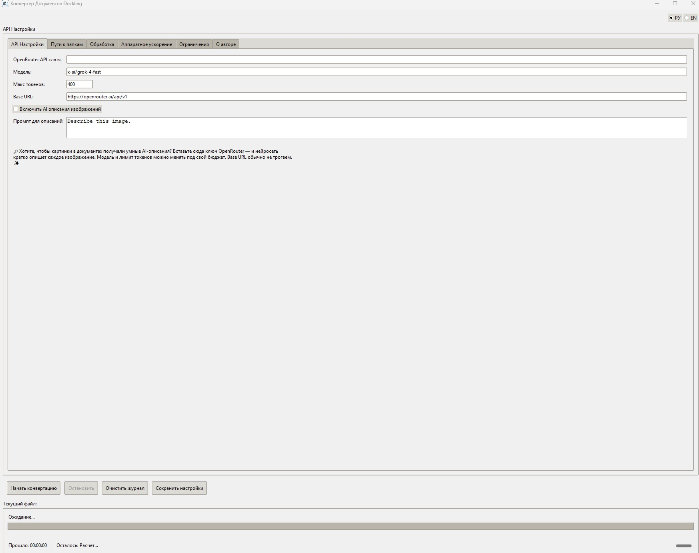
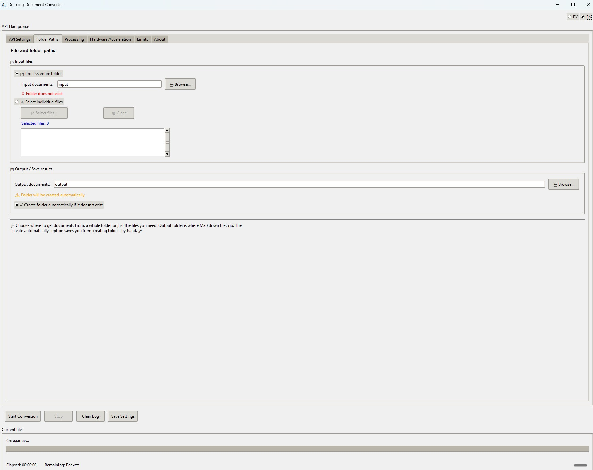
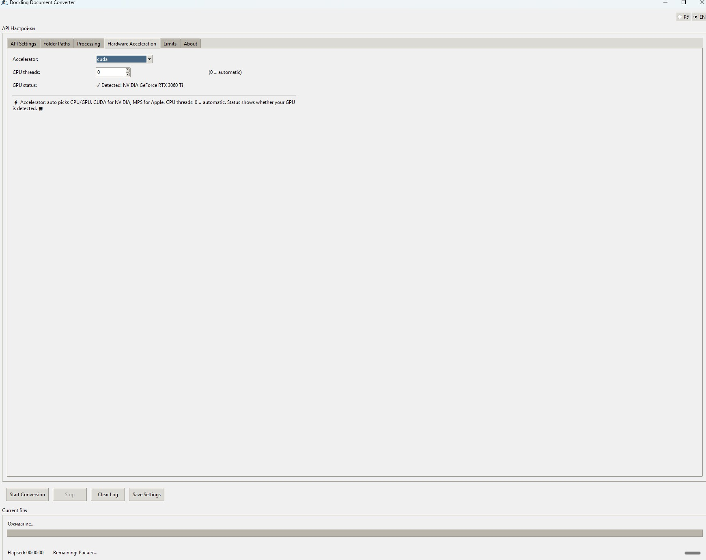
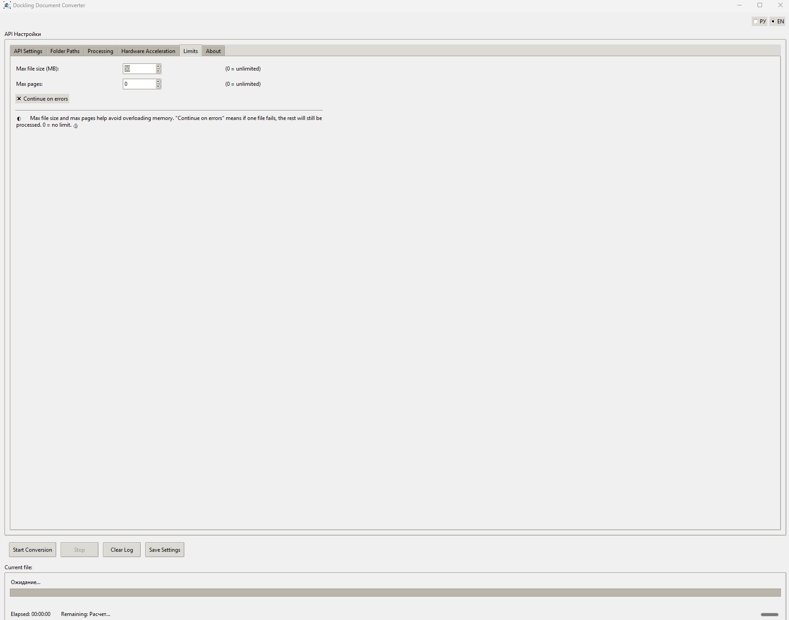

# Dockling WINGUI

**Главная цель проекта — решение, работающее из коробки:** конвертация документов (PDF, DOCX, PPTX, XLSX, HTML и др.) в Markdown для последующей загрузки в RAG и использования в ИИ-системах.

Часто не хватает готового инструмента: приходится собирать пайплайн из скриптов, настраивать Python, OCR-модели и зависимости. **Dockling WINGUI** закрывает эту задачу: один EXE, выбор папок, конвертация. Основа — [Docling](https://github.com/docling-project/docling) (IBM).

---

## Быстрый старт

1. **Скопируйте** `env.example` в `.env` (в ту же папку, что и `DocklingGUI.exe`).
2. **Создайте** папки `input` и `output` (или укажите свои пути в настройках).
3. **Запустите** `DocklingGUI.exe`.
4. В интерфейсе выберите папки, при необходимости настройте OCR, таблицы, GPU и нажмите **«Начать конвертацию»**.

> **Важно:** первый запуск обычно занимает **более 2 минут** (инициализация моделей, при необходимости — загрузка EasyOCR). Окно может «зависнуть» — это нормально, дождитесь появления интерфейса. Последующие запуски значительно быстрее.

Решение работает из коробки: EXE, `.env`, папки, конвертация. Подробнее: **START_HERE.txt**, **DOCUMENTATION_RU.md**.

---

## Содержимое релиза

| Файл / папка       | Описание |
|--------------------|----------|
| `DocklingGUI.exe`  | Основное приложение, работает из коробки (Windows, 64‑bit). |
| `env.example`      | Шаблон настроек. Скопируйте в `.env` и отредактируйте. |
| `images/`          | Иконки и изображения для GUI. |
| `README_RU.md`     | Этот файл (краткое описание на русском). |
| `README_EN.md`     | Краткое описание на английском. |
| `DOCUMENTATION_RU.md` | Подробная документация на русском. |
| `DOCUMENTATION_EN.md` | Подробная документация на английском. |
| `START_HERE.txt`   | Краткая памятка по первому запуску. |
| `*.py`, `requirements.txt`, `build_exe.spec` | Исходный код и скрипты сборки для разработки. |
| `Images_frames/` | Скриншоты интерфейса (вкладки настроек). |

---

## Скриншоты интерфейса

Снимки экрана основных вкладок приложения (папка `Images_frames/`).

### 1. Вкладка «API Настройки»

Настройка OpenRouter API для AI‑описаний изображений: ключ, модель (например, x-ai/grok-4-fast), макс. токенов, Base URL. Чекбокс «Включить AI описания изображений» и поле «Промпт для описаний». Внизу — подсказка по использованию. Кнопки «Начать конвертацию», «Остановить», «Очистить журнал», «Сохранить настройки»; строка состояния: «Текущий файл», «Прошло», «Осталось».

---

### 2. Вкладка «Пути к папкам»

Режимы: «Обработать всю папку» или «Выбрать отдельные файлы». Поле «Входящие документы» и кнопка «Выбрать...»; при несуществующей папке — предупреждение. Блок «Исходящие документы» с галочкой «Создать папку автоматически». Подсказка внизу вкладки. Строка прогресса: «Текущий файл», «Прошло», «Осталось».

---

### 3. Вкладка «Пути к папкам» (выбор файлов)

Тот же экран с акцентом на режим «Выбрать отдельные файлы»: кнопки «Выбрать файлы...» и «Очистить», счётчик «Выбрано файлов: 0» и список выбранных файлов. Состояние папок ввода/вывода и подсказка.

---

### 4. Вкладка «Аппаратное ускорение»

Выбор ускорителя (AUTO, CPU, CUDA, GPU, MPS) и числа потоков CPU (0 = автоматически). Статус GPU, например: «Обнаружен: NVIDIA GeForce RTX 3060 Ti». Подсказка по настройке ускорения. Нижняя панель с кнопками управления и таймером.

---

### 5. Вкладка «Ограничения»

«Макс. размер файла (МБ)» и «Макс. страниц» (0 = без ограничений). Чекбокс «Продолжать при ошибках». Поясняющий текст. Кнопки «Начать конвертацию», «Остановить», «Очистить журнал», «Сохранить настройки» и строка «Текущий файл», «Прошло», «Осталось».

---

## Системные требования

- **ОС:** Windows 10/11 (64‑bit).
- **Память:** минимум 4 ГБ ОЗУ, рекомендуется 8 ГБ.
- **Место на диске:** ~3 ГБ (с учётом EXE и рабочих папок).
- **GPU:** опционально, NVIDIA с поддержкой CUDA для ускорения.

---

## Поддерживаемые форматы

PDF, DOCX, DOC, PPTX, PPT, XLSX, XLS, HTML, HTM, XML, MD, AsciiDoc.

---

## Язык интерфейса

В правом верхнем углу окна переключатель **РУ** / **EN** (русский и английский).

---

## Tesseract (OCR)

По умолчанию используется **EasyOCR** (уже встроен).  
Если выбран **Tesseract**:

- Нажмите **«Установить Tesseract...»** во вкладке **«Обработка»** — откроется страница загрузки и краткая инструкция.
- Или установите вручную: [Tesseract at UB-Mannheim](https://github.com/UB-Mannheim/tesseract/wiki), в каталог по умолчанию `C:\Program Files\Tesseract-OCR`.

---

## Ручная сборка EXE

Инструкция по сборке исполняемого файла из исходников — в **DOCUMENTATION_RU.md**, раздел **«9. Ручная сборка EXE»**.

## Документация

- **DOCUMENTATION_RU.md** — полное руководство на русском (настройки, OCR, таблицы, API, ручная сборка, решение проблем).
- **DOCUMENTATION_EN.md** — то же на английском.

---

## Лицензии

В приложении используются сторонние компоненты:

— **Docling (IBM).** Лицензия MIT.  
Данная технология обеспечивает качественную конвертацию документов.  
Мы выражаем благодарность разработчикам IBM за создание этого инструмента.

Подробности: [Docling](https://github.com/docling-project/docling).
